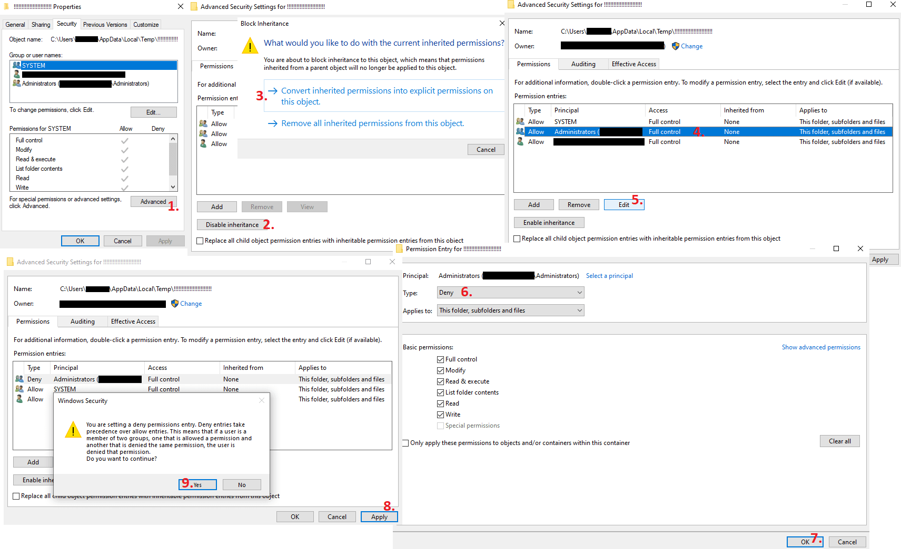

 

> **Note**
>
> - The splitter now patches the `%TEMP%` bug and stops kuso Demo from attempting to delete your Temp folder.
> - The patch is ***temporary*** - it does not edit any files. You have to load the splitter every time you run the game.
> - You should still create the `!!!!!!!!!!!!!!!!!!!!!!!!` folder as described below, to protect `%TEMP%` even without LiveSplit.

 

## LOVE 2: kuso (Demo) breaks all Auto Splitters

### Bug

- When exiting ***kuso Demo***, it attempts to recursively delete the contents of `%TEMP%` folder. 
If successful, it deletes the empty Temp folder - usually `%LOCALAPPDATA%\Temp`, `C:\Users\name\AppData\Local\Temp`.

- LiveSplit cannot load auto splitters without the ***Temp*** folder, so you have to stop kuso Demo from deleting it.

### Workaround

1. If the Temp folder is already gone, create it manually or reboot Windows.

2. Make a folder called `!!!!!!!!!!!!!!!!!!!!!!!!` ***inside*** the Temp folder. Yes, just a bunch of exclamation points.\*

3. *Right-click* the `!!!!!!!!!!!!!!!!!!!!!!!!` folder -> *Properties* and follow the steps shown in this image (assuming you're an admin).

4. Try to delete the `!!!!!!!!!!!!!!!!!!!!!!!!` folder. You shouldn't be able to.

5. Note that the `!!!!!!!!!!!!!!!!!!!!!!!!` folder might still get deleted when updating Windows, for example.

6. Restart LiveSplit and load the splitter.

 

\**kuso Demo reads the contents of the Temp folder in a specific order. Folders first, exclamation point first. 
By using many exclamation points you pretty much ensure that it'll be the first thing the game reads. 
After the first failed attempt to delete something, it'll give up and leave rest of the folders / files alone.*
