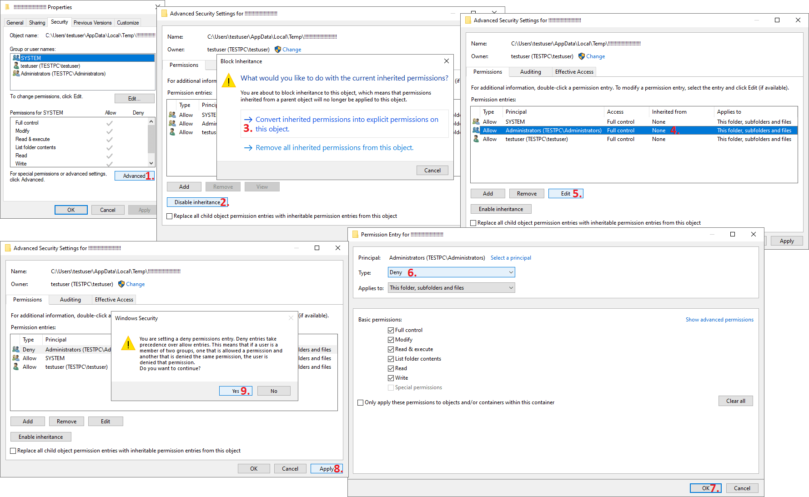

## LOVE 2: kuso (Demo) breaks all auto splitters

### Bug

When exiting kuso Demo, it attempts to recursively delete the contents of `%TEMP%` folder. 
If successful, it deletes the empty Temp folder - usually `%LOCALAPPDATA%\Temp`, `C:\Users\name\AppData\Local\Temp`.\*

LiveSplit cannot load auto splitters without the Temp folder, so you have to stop kuso Demo from deleting it.

If the Temp folder is already gone, create it manually or reboot Windows, then restart LiveSplit.

### Workaround #1

Patch the bug by enabling `Stop the game from deleting %TEMP% folder` splitter setting. It is disabled by default. 
The patch is temporary - it does not edit any files. You have to re-apply the patch every time you run the game.

You should still create the `!!!!!!!!!!!!!!!!!!!!!!!!` folder as described below, to protect `%TEMP%` even without LiveSplit.

### Workaround #2

1. Make a folder called `!!!!!!!!!!!!!!!!!!!!!!!!` inside the Temp folder. Yes, just a bunch of exclamation points.\*\*

2. **Right-click** the `!!!!!!!!!!!!!!!!!!!!!!!!` folder -> **Properties** and follow the steps shown in this image (assuming you're an admin).

3. Try to delete the `!!!!!!!!!!!!!!!!!!!!!!!!` folder. You shouldn't be able to.

4. Note that the `!!!!!!!!!!!!!!!!!!!!!!!!` folder might still get deleted when updating Windows, for example.

 

\**This GameMaker bug was fixed after kuso Demo was released, but the game hasn't been updated so the bug remains.*

 

\*\**kuso Demo reads the contents of the Temp folder in a specific order. Folders first, exclamation point first. 
After the first failed deletion attempt, the game will leave rest of the folders/files alone, and exit.*
